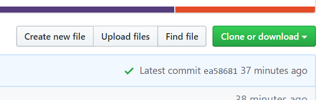
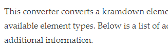
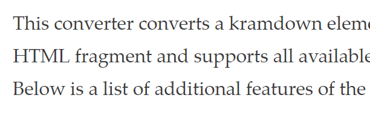

# Build Your Website

This is a note to self, mainly, on how I built my own personal website.

Before we get started, we should talk about how we can get a website.
There are two issues here: getting a **host** and getting a **domain**.
The host is the physical server where your website (the HTML pages) are stored.
The domain is the URL that directs visitors to the website.

### Hosting

There is a whole spectrum of hosting solutions to choose from.
Such spectrum is characterized by the technical difficulty in setting up and managing your website.
But it also ranges in terms of flexibility you get, such as getting the design you prefer.

On the easy (but not very flexible) side we have options such as [Google Sites](https://sites.google.com/), [WordPress](https://wordpress.com/) and [Squarespace](https://www.squarespace.com/).
These are easy-to-set-up hosting solutions, meaning that those companies will provide the hardware where your website will be stored.
They will not expose the folder structure of the website to you, so you will not directly work on the files that constitute the website.
Rather, they will provide an easy interface to build your website, typically with a point-and-click interface.
These solutions are appealing because you can get a website with no coding experience.
The cost here is that you do not get enough flexibility, so your website will probably never look _exactly_ the way your would like.
This post does _not_ deal with this kind of hosting.

On the other hand, you may set up your own, physical server and manage it by yourself.
This requires much knowledge about how the Internet works, how to get a static IP address (in order to reach your server) and so on.
It is quite complicated to do that.
This post does _not_ deal with this kind of hosting either.

A reasonable (in my opinion) middle-ground solution is given by [GitHub Pages](https://pages.github.com/) or [GitLab Pages](https://about.gitlab.com/product/pages/).
These are hosting solutions that can serve [static websites](https://en.wikipedia.org/wiki/Static_web_page).
You get to manage the individual files, so you can get the website to look exactly like you want it, provided you know how to do it.
You can also get predefined templates (think themes).
You also do not get into the intricacies of setting up a physical server and you do not have to worry about how the Internet works.
These solutions are also free of charge.
This post deals with this sort of hosting solution.


### Domain

A domain is a name that you type in the URL bar of your web browser.
More technically, it is a human readable form of an IP address.
It is the destination that you type into a web browser in order to visit a website.
Getting a custom domain is costly.
There are many vendors that sell domains, among which we have [Google](https://domains.google/), [Domain.com](https://www.domain.com/domains/), [namecheap](https://www.namecheap.com/) and [GoDaddy](https://www.godaddy.com/).
Prices vary, but it is common to see them ranging from 8 to 20 EUR yearly.


## The gist of it

Make sure to have [Ruby](https://www.ruby-lang.org/) installed, together with the gems [Bundler](https://bundler.io/) and [Jekyll](https://jekyllrb.com/).
Then, to create a new website from scratch, execute the following from a terminal:

```bash
$ jekyll new new_website    # creates folder "new_website"
$ cd new_website            # moves into new folder
$ bundle exec jekyll serve  # generates a local preview of website
```

Open up a tab on your browser, navigate to [`http://localhost:4000/`](http://localhost:4000/).
Here you will see the newly created website.


## Setup

From here on we get into the details.
First I describe the sort of environment I am working in.
Then I present a small tutorial on how to get a website similar to mine.


### Preliminary information

In the following there are some code blocks.
A line in code block starting with the dollar symbol (`$`) denotes a Shell prompt.
Linux and macOS both come with a shell (either [Bash](https://en.wikipedia.org/wiki/Bash_(Unix_shell)) or [Zsh](https://en.wikipedia.org/wiki/Z_shell)).
This may appear in your system as an application called Terminal.
I won't write here why using a terminal might be better than using a point-and-click interface.
It should suffice to say: giving instructions through a terminal is much easier (and unambiguous) relative to a point-and-click interface.

If you are on Windows 10, you do not have an adequate shell out of the box (yes, you have PowerShell, but it sucks).
In this case, install the [Windows Subsystem for Linux](https://docs.microsoft.com/en-us/windows/wsl/install-win10) (WSL) and you will obtain a full-fledged Linux environment to work with.


### Operating environment

The following requires [Ruby](https://www.ruby-lang.org/), [Bundler](https://bundler.io/) and [Jekyll](https://jekyllrb.com/).
Both Bundler and Jekyll are libraries written in the Ruby programming language.
Ruby libraries are called Gems.
Bundler takes care of ensuring that all required _dependencies_ are installed.
This is necessary because, under the hood, [we are using many other Ruby gems](https://pages.github.com/versions/) and our computer needs to have them.
Jekyll instead is the "engine" that translates a relatively simple folder structure with mostly [Markdown](https://daringfireball.net/projects/markdown/) files into a full fledged HTML website.
We first need to install Ruby.
Once we have Ruby, we can install gems.

To install Ruby on an APT-based Linux distribution (e.g., Debian, Ubuntu), execute

```bash
$ sudo apt install ruby
```

If you are on a non-Linux environment, such as macOS or bare Windows, or on a non APT-based Linux distribution (e.g., Fedora), then your installation instruction for Ruby will differ.

Once Ruby is installed, we need to install Bundler and Jekyll.

```bash
$ gem install bundler jekyll
```


### First (local) setup

Create a new website from scratch, based on a default Jekyll template.

```bash
$ jekyll new <website-folder-name>
```

This creates a folder called `<website-folder-name>` in your current working directory.
Inside this folder, we will already find some files.
The newly created folder is the root folder of the website.
It also delivers a minimal working Jekyll setup based off the [Minima Jekyll theme](https://github.com/jekyll/minima).

To preview the website locally, enter the newly created folder and run

```bash
$ bundle exec jekyll serve
```

The terminal will print some lines, one of which will be like the following:

```bash
Server address: http://127.0.0.1:4000
```

This _local_ address can now be reached through your web browser to preview the website.
The website is not yet public though.
As soon as you change a file in the website folder, the Jekyll instance will instantly update your website.
You can terminate the Jekyll instance by pressing <kbd>Ctrl</kbd> + <kbd>C</kbd> at any time.

In this setup, we have two crucial files: `Gemfile` and `_config.yml`.
The first relates to Bundler and keeps track of all Ruby requirements needed to build the website.
The second relates to Jekyll and contains some settings about the website.


### Ensure compatibility with GitHub Pages

So far all we did was ensuring we can build the website locally.
However, we want the website to go live publicly.
Here I assume we use GitHub as host for our website.

GitHub is strict about the use of Jekyll.
In particular, [non-default plugins are forbidden](https://help.github.com/en/github/working-with-github-pages/about-github-pages-and-jekyll#plugins) and un[supported themes](https://pages.github.com/themes/) are not trivial to use.

The default Gemfile that was created with `jekyll new` contains the following comment:

```bash
# If you want to use GitHub Pages, remove the "gem "jekyll"" above and
# uncomment the line below. To upgrade, run `bundle update github-pages`.
```

Do as it says.


### Uploading the website to GitHub, for publication

To publish the website using GitHub Pages, you need to create a repository at [github.com](https://github.com).
If you do not have a custom domain yet, and want your website to appear automatically, then the repository you create must have the name `[username].github.io`, which will also be the URL at which your website will be found.
Once you have the repository, move all files created by Jekyll above into the git repository.
As soon as you push the new files to GitHub, GitHub will start building your website.
It will be publicly available at `[username].github.io` after few minutes.
GitHub will only build using the files in the `master` branch.
If you push updates to your code in another branch, then GitHub will ignore them until you merge into `master`.

(If you are using GitHub, the last two sentences must make sense to you)
{: .fs-2 }


### Making sure that GitHub will render and publish

If there are problems with your build, GitHub will normally send you an email about the build status.
You will receive an email in case of errors and/or warnings.
If everything goes well, you will not receive an email, but you will see a green checkmark in the blue box above your files at the online repository.




## Adding pages and content

So far the directory structure of your website will look like the following

```
./
├── 404.html
├── about.markdown
├── _config.yml
├── Gemfile
├── Gemfile.lock
├── index.markdown
└── _posts
    └── 2019-12-10-welcome-to-jekyll.markdown
```

The content of your webpages will be included in [Markdown](https://en.wikipedia.org/wiki/Markdown) files, which is a stripped down version of HTML.
For instructions on how to write Markdown syntax, see [here](https://daringfireball.net/projects/markdown/syntax).
Markdown files have either `.markdown` or `.md` as extension.
To see an example, see [the file where this current content is written](https://raw.githubusercontent.com/apsql/apsql.github.io/master/_posts/2019-11-26-build-your-website.md).

To add a new page to your website, create a new Markdown file.
In this new file, add the following text.

```markdown
---
layout: page
title: Research
permalink: /research/
---
```

This text says the following:

- the visual layout will be "page" (defined in `./_layouts/page.html`)
- the page title will be "Research" (displayed in the browser tab and at the top of the page itself, if the theme allows that)
- the webpage will be accessible with the URL `your.website.com/research/`)

The folder `_layouts` will not be present in your website folder as it is.
Instead, it will be present in the default directory of the theme Jekyll uses.
To show where such folder is, run

```bash
bundle show minima
```

After the triple hyphen `---`, you can start writing the content of your page.
Use [Markdown syntax](https://daringfireball.net/projects/markdown/syntax) to write content.
Coming from LaTeX, it will be familiar.

Finally, we need to make your website aware of the new page.
This is not necessary if you put the files of your pages in the root folder of your website.
Instead, if you put all files in a dedicated subfolder (like `_pages` in my case), then you need to modify the file `_config.yml`.
It may already contain the line

```yaml
include: ["_posts"]
```

You may want to change it with

```yaml
include: ["_pages", "_posts"]
```

This way Jekyll will look at the contents of the folders specified with `include` when building the website.

There is one final thing to consider.
The _landing page_ of your website will _always_ be the file `index.markdown`.
You cannot change the name of the file (i.e., `index`) because this is a standard.
You can inspect its contents: it will be

```markdown
---
# Feel free to add content and custom Front Matter to this file.
# To modify the layout, see https://jekyllrb.com/docs/themes/#overriding-theme-defaults

layout: home
---
```


## Changing the theme

The default Jekyll theme, [Minima](https://github.com/jekyll/minima), is advertised as a _one size fits all_ theme, but it is mostly oriented towards blogs.
As my personal webpage is not intended to be a blog (at the moment), I changed the theme.
In particular, I wanted a sidebar with links to the main sections of my website.

There are many Jekyll themes out there, see [Jekyll's page](https://jekyllrb.com/docs/themes/) on the matter.
The one I use is called [Just the Docs](https://pmarsceill.github.io/just-the-docs/).
On a computer screen, it has a sidebar for easy navigation and a main body part that is large enough for normal content.
Content does not necessarily span the whole horizontal space, so [text lines won't be too long](https://en.wikipedia.org/wiki/Line_length).
On a mobile device, the sidebar is hidden and can be accessed with a [Hamburger Button](https://en.wikipedia.org/wiki/Hamburger_button).
To learn how to use the Just the Docs theme, see the author's [Getting Started section](https://pmarsceill.github.io/just-the-docs/#getting-started).

Given the output of the [First Setup](#first-setup) above, we can do the following.
First, in the `Gemfile`, we replace the line

```
gem "minima", "~> 2.5"
```

with

```
gem "just-the-docs"
```

which instructs Bundler to go fetch the gem called `just-the-docs`.
This gem contains all the files necessary to build and render the website using the new theme.
Second, in the file `_config.yml`, we replace the line

```
theme: minima
```

with

```
theme: "just-the-docs"
```

Once you rebuild the site with `bundle exec jekyll serve`, the local copy of website will adopt the new theme.

> **Note:** every time you change a file in the website folder, Jekyll will automatically rebuild the website locally (you will see this happening in your terminal) for you to verify your changes if you refresh the browser window. However, this cannot happen when you change the `_config.yml` file for technical reasons. To see the changes to `_config.yml`, you need to terminate Jekyll in the terminal and relaunch it.

> **Note:** With the changes above, only the local website will correctly use the new theme. When you push your work to GitHub, you need to tell GitHub how to find the theme you want. For this reason, it is best to stick to a Jekyll theme that is stored in a GitHub repo, so GitHub will automatically know what to do with it. To point GitHub to the files required for the Just the Docs theme. we open the `_config.yml` file and we replace the line
>
> ```
> theme: "just-the-docs"
> ```
>
> with
>
> ```
> remote_theme: pmarsceill/just-the-docs
> ```
> With this change, the command `bundle exec jekyll serve` will no longer use local files to build previews of your website. The theme will have to be downloaded every time you run that command. This means that your preview may not work properly if your computer is not connected to the internet. A way to circumvent this is to undo the last change to `_config.yml` and work locally until an internet connection is established again.

At this stage, there is one thing not working.
The Just the Docs theme has a search bar at the top of each page.
This won't work with the configuration so far.
We need to set it up.
The instructions are [here](https://pmarsceill.github.io/just-the-docs/docs/search/).

```bash
$ bundle exec just-the-docs rake search:init
```

With this, the search bar will start working.
You may want to exclude certain pages (and their contents) from appearing in the search box.
This may be the case for the `404.html` page you have in the root folder of the website.
All you need to do is to open such page and, in the preamble (delimited with `---`), add the following line

```
search_exclude: true
```


### Customize the theme

Now that we are using a theme, we may want to customize it, so that it does not look exactly like the original.
To do so, we need to tweak files into certain special folders.
Notable such folders carry the names `_includes`, `_layouts` and `_sass`.
Given the instructions in [First Setup](#first-setup), we do not have those folders in our root folder.
We need to find them and copy them over.
Once they're copied, we can modify the copies to override certain defaults (e.g., the color of the hyperlinks).

If the theme of your choice is well documented, it will tell you what to do.
In the case of Just the Docs, see [this page](https://pmarsceill.github.io/just-the-docs/docs/customization/) to know what to do from this point on.
In particular, the documentation mentions the file `./sass/custom/custom.scss`.
This file is in the folder where all Ruby gems are stored.

We can locate the required files by running

```bash
$ bundle show just-the-docs
```

Call the result of such command `<that-folder>`.
Then, we can copy the files we need over

```bash
$ cp <that-folder>/_sass/custom/custom.scss ./_sass/custom/custom.css
```

Now we can modify the contents of this file (the one in the root folder of your website, not the one in `<that-folder>`!) to override default theme settings.

You can learn more about the `cp` command [here](http://man7.org/linux/man-pages/man1/cp.1.html).
{: fs-2 }


#### Changing fonts

While the theme of your choice will (should) explain how to change some things, such as the color of hyperlinks and the background color, there is one thing we may want to change that is not easily documented in the theme: fonts.

Fonts are an incredibly complicated matter.
Clearly there is an element of personal taste.
But there is also an objective issue related to font rendering.

The vast majority of computers run on Windows, which has a set of default fonts pre-installed.
Apple includes in macOS other fonts.
Linux distributions also have yet different fonts.
Finding a font that lies in the intersection of pre-installed fonts across Operating Systems is near impossible, because such intersection is either empty or of near-zero measure (and I did not even mention mobile devices).

Adding to this, each OS renders fonts in different ways.
Windows uses [ClearType](https://en.wikipedia.org/wiki/ClearType), which applies aggressive [font hinting](https://en.wikipedia.org/wiki/Font_hinting) to fit each [glyph](https://en.wikipedia.org/wiki/Glyph) to the arrays of subpixels in our screens.
This is the reason for which geometric fonts typically display better on Windows, while other less boring fonts do not display as intended by the designer.
macOS instead [refuses](https://www.howtogeek.com/358596/how-to-fix-blurry-fonts-on-macos-mojave-with-subpixel-antialiasing/) to hint fonts altogether.
Font rendering in Linux is [all over the place](https://pandasauce.org/post/linux-fonts/).
Related to this, screens are of different resolutions and sizes, amounting to different pixels densities.

Consider the two following screenshots.




These have been taken from the same Windows machine and the same screen, just at different zoom levels.
The different zoom levels approximate the difference between a low pixel density and a high pixel density screen.
Comparing the screenshots, we see that at low resolutions Windows prefers legibility of the font at the expense of the design of the font.
macOS instead will preserve the design of the font, at the expense of legibility (see [here](https://pandasauce.org/post/linux-fonts/) for proof).

All this is to say that what looks good on _your_ screen does not necessarily look good in the screens of your audience.
Choosing a font for your website is objectively difficult precisely for this reason.

_"Alright, but how do I do it?"_
The main technical concern here is that not all devices will have a local copy of the font you choose, so we need to use a remote web font.
[Google Fonts](https://fonts.google.com/) is a good choice for this.
Go there and find a font that you like.
My choice is on [Fira Sans](https://en.wikipedia.org/wiki/Fira_Sans), a font commissioned by Mozilla for their ([DOA](https://en.wikipedia.org/wiki/Dead_on_arrival)) [Firefox OS](https://en.wikipedia.org/wiki/Firefox_OS).
Once we select the font we want, Google will tell us how to use it in our website.
There are two steps: _embedding_ and _using_.
For embedding, Google will provide a line like this one

```html
<link href="https://fonts.googleapis.com/css?family=Fira+Sans" rel="stylesheet">
```

For using, Google will tell us to specify the following in a CSS stylesheet

```css
font-family: 'Fira Sans'
```

In the Just the Docs theme we can use a special file.
This is `/_includes/head_custom.html`.
Here we can put all pure HTML code that will be included in the [`<head>`](https://www.w3schools.com/html/html_head.asp) section of your website.
This is the place where we put the first line Google gives us, the one with the `<link>` tag.
Finally, we tell the website to use the theme.
The file `/_sass/custom/custom.scss` gives us a way to do it.
Originally, it has a line

```scss
//$body-font-family: -apple-system, BlinkMacSystemFont, "helvetica neue", helvetica, roboto, noto, "segoe ui", arial, sans-serif;
```

which we replace with

```scss
$body-font-family: 'Fira Sans', -apple-system, BlinkMacSystemFont, "helvetica neue", helvetica, roboto, noto, "segoe ui", arial, sans-serif;
```

Now, our website will pull the Fira Sans font from Google Fonts and then will use it everywhere in the site.
You do not need to worry about devices that do not have local copies of the font, because we are using a remote copy of it.


## Conclusion

Here I took my own notes on how to build a website and polished them a little bit (not too much, my regressions are waiting for me).
Building a website with Jekyll for publication through GitHub Pages requires a bit of technical knowledge about HTML and (you know) Jekyll, but it is far easier than building the whole website from scratch only using HTML/CSS.
The bonus is flexibility: if you know how to do what you want, you can get it and GitHub will comply (I'm looking at you, Google Sites).
I hope these guidelines will be useful to somebody.

If you want to send feedback, ask for clarification or directly improve this webpage, open an issue or a pull request on the [repository](https://github.com/apsql/apsql.github.io/)!
{: .fs-2}
